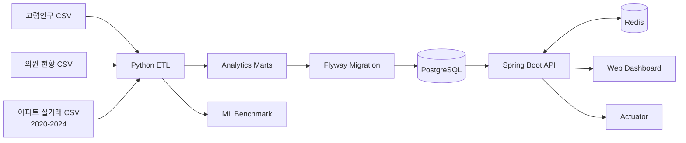

# Regional Insight Korea

> 공공데이터 분석 노트북을 **재현 가능한 데이터 파이프라인, ML 기준선, Java REST API,
> 운영 가능한 인프라와 웹 대시보드**로 확장한 엔드투엔드 포트폴리오 프로젝트

[](https://github.com/taeyoungk-dev/data_analysis/actions/workflows/ci.yml)
[](https://openjdk.org/)
[](https://spring.io/projects/spring-boot)
[](https://www.python.org/)
[](LICENSE)

**Regional Insight Korea**는 두 개의 기존 학습 프로젝트를 하나의 서비스로 재설계했습니다.

- 경기도 31개 시·군의 **고령인구 대비 의료 공급 우선순위** 분석
- 서울 25개 자치구의 2020–2024년 **아파트 가격·성장·거래 강도** 분석

Python이 원천 데이터를 정제하고 설명 가능한 지표와 ML 기준선을 생성하면, Flyway가 그
결과를 PostgreSQL에 적재합니다. Spring Boot API는 Redis 캐시를 거쳐 데이터를 제공하고,
반응형 웹 대시보드가 이를 시각화합니다.

**English summary:** An end-to-end public-data intelligence platform that turns two notebook-based
analyses into tested Python data products, a Java/Spring REST API, PostgreSQL/Redis infrastructure,
an ML benchmark, CI and a responsive dashboard.

---

## 이 프로젝트가 해결하는 문제

기존 저장소는 데이터 분석 학습 과정을 잘 보여주지만, 노트북 셀 순서·로컬 절대경로·수동
전처리에 의존해 다른 환경에서 재현하기 어려웠습니다. 또한 분석 결과를 다른 시스템이
사용할 계약(API)과 테스트, 운영 구성이 없었습니다.

이 프로젝트에서는 다음 질문을 서비스 가능한 형태로 바꿨습니다.

1. **경기도에서 고령인구 비율은 높고 의원 공급은 상대적으로 부족한 곳은 어디인가?**
2. **서울에서 현재 가격, 5년 가격 변화, 거래 유동성을 함께 볼 때 시장 강도가 높은 곳은 어디인가?**

두 데이터는 지역 범위와 의미가 다르므로 하나의 “살기 좋은 지역 점수”로 억지로 합치지
않았습니다. 하나의 플랫폼 안에서 독립된 도메인 지표로 제공하는 것이 데이터 해석상 더
정직한 설계입니다.

## 주요 결과

2026년 9월 현재 저장된 원본으로 파이프라인을 재실행한 결과입니다.

| 분석 | 범위 | 우선순위 1위 | 핵심 수치 |
|---|---:|---|---|
| 고령층 의료 접근성 | 경기도 31개 시·군 | 연천군 | 고령인구 33.29%, 고령인구 1만 명당 의원 21.96개, 우선점수 98.50 |
| 주택시장 강도 | 서울 25개 자치구 | 서초구 | 2024 중위 거래가 23.5억 원, 2020–2024 가격/㎡ CAGR 11.14%, 시장점수 93.75 |

주택가격 ML 기준선은 2024년 56,193건을 고정 시드로 80:20 분리했습니다.

| Model | Train / Test | MAE | R² |
|---|---:|---:|---:|
| HistGradientBoostingRegressor | 44,954 / 11,239 | 약 1.47억 원 | 0.9307 |

이 결과는 학습용 기준선입니다. 랜덤 홀드아웃은 시간에 따른 일반화 성능을 보장하지 않으며,
지표와 모델 모두 정책 판단·감정평가·투자 추천 용도로 사용할 수 없습니다.

## 기술 스택

| 영역 | 기술 | 프로젝트에서의 역할 |
|---|---|---|
| Language | Java 21, Python 3.11+, SQL, JavaScript | API, 분석/ML, DB migration, UI |
| Backend | Spring Boot 4.1, Spring MVC, Spring Data JPA, Bean Validation | 계층형 REST API와 입력 검증 |
| Data / ML | pandas, scikit-learn, joblib | 정제, feature engineering, percentile scoring, 기준 모델 |
| Database | PostgreSQL 17, H2, Flyway | 운영형 저장소, 빠른 로컬 프로필, 버전형 스키마/시드 |
| Cache | Redis 8, Spring Cache | 조회 결과 10분 캐싱 |
| Frontend | Semantic HTML, CSS, Vanilla JS | 외부 프레임워크 없는 반응형 데이터 대시보드 |
| DevOps | Docker Compose, Gradle, GitHub Actions | 동일 실행 환경, 빌드·테스트·생성물 drift 검사 |
| Observability | Spring Boot Actuator | health, readiness/liveness, metrics |
| Quality | pytest, JUnit, MockMvc, Ruff | 계산·ETL·API 계약·코드 품질 검증 |

## 아키텍처



구체적인 경계와 설계 판단은 [Architecture](docs/architecture.md), 필드 정의와 계산식은
[Data Dictionary](docs/data-dictionary.md)에서 확인할 수 있습니다.

## 로컬에서 보는 가장 쉬운 방법

필수 프로그램은 **Git**과 **Docker Desktop**입니다.

```bash
git clone https://github.com/taeyoungk-dev/data_analysis.git
cd data_analysis
docker compose up --build
```

처음 실행할 때 Java/DB 이미지를 내려받으므로 몇 분 걸릴 수 있습니다. 로그에
`Started RegionalInsightApiApplication`이 보이면 브라우저에서 아래 주소를 엽니다.

- 대시보드: [http://localhost:8080](http://localhost:8080)
- API 헬스 체크: [http://localhost:8080/actuator/health](http://localhost:8080/actuator/health)
- 전체 요약 API: [http://localhost:8080/api/v1/overview](http://localhost:8080/api/v1/overview)

종료:

```bash
docker compose down
```

DB 데이터까지 초기화하려면 `docker compose down -v`를 사용합니다. 이 명령은 로컬 Docker
volume의 PostgreSQL 데이터도 삭제하므로 재생성이 필요할 때만 실행하세요.

### Docker 없이 Java API 실행

Java 21이 설치돼 있다면 H2 인메모리 DB와 단순 로컬 캐시로 실행할 수 있습니다.

```bash
cd backend
./gradlew bootRun --args='--spring.profiles.active=local'
```

이 모드는 PostgreSQL·Redis를 필요로 하지 않으며 애플리케이션을 종료하면 DB가 사라집니다.

## 분석 파이프라인 재실행

Python 3.11 이상을 사용합니다.

```bash
python3 -m venv .venv
source .venv/bin/activate              # Windows: .venv\Scripts\activate
python -m pip install -e './analytics[dev]'

python -m regional_insight.cli build   # CSV marts + Flyway seed 재생성
python -m regional_insight.cli train   # ML 평가 + 로컬 모델 artifact 생성
# 또는 두 작업을 한 번에
python -m regional_insight.cli all
```

생성 결과:

- `analytics/data/processed/health_access.csv`
- `analytics/data/processed/housing_market.csv`
- `analytics/artifacts/model_metrics.json`
- `backend/src/main/resources/db/migration/V2__seed_analytics.sql`

학습된 `*.joblib` 파일은 크기와 재현 가능성을 고려해 Git에 포함하지 않습니다.

## API 사용 예시

```bash
# 전체 요약
curl http://localhost:8080/api/v1/overview

# 의료 접근 우선순위 상위 5개 지역
curl 'http://localhost:8080/api/v1/health-access?limit=5'

# 특정 경기도 지역
curl http://localhost:8080/api/v1/health-access/연천군

# 주택시장 강도 상위 5개 지역
curl 'http://localhost:8080/api/v1/housing?limit=5'

# 특정 서울 자치구
curl http://localhost:8080/api/v1/housing/서초구
```

`limit`은 의료 API에서 1–31, 주택 API에서 1–25만 허용됩니다. 잘못된 값에는 HTTP 400,
존재하지 않는 지역에는 HTTP 404 Problem Details 응답을 반환합니다.

## 점수 산정 방식

### 의료 접근 우선점수

```text
priority_score =
  고령인구 비율 percentile × 0.55
  + 고령인구 1만 명당 활성 의원 수의 역 percentile × 0.45
```

`영업/정상`, `영업중` 상태만 활성 의원으로 셉니다. 이 점수는 수요와 공급의 1차 선별
지표이며 진료과목, 병상, 이동시간, 의료의 질과 인접 시·군 이용은 포함하지 않습니다.

### 주택시장 강도점수

```text
market_heat_score =
  2024 중위 가격/㎡ percentile × 0.50
  + 2020–2024 중위 가격/㎡ CAGR percentile × 0.30
  + 2024 거래량 percentile × 0.20
```

절대값이 아닌 서울 25개 자치구 내부 상대 순위입니다. 원천 거래의 추후 취소·정정과
거시경제·소득·금리 변수는 반영하지 않습니다.

## 테스트와 CI

```bash
# Python
source .venv/bin/activate
ruff check analytics
pytest analytics/tests

# Java 21
cd backend
./gradlew test

# 전체 스택 상태
docker compose ps
curl http://localhost:8080/actuator/health
```

GitHub Actions는 pull request와 `main` push마다 다음을 확인합니다.

- Python lint 및 계산/ETL 단위 테스트
- 실제 원본 데이터 재처리 후 커밋된 CSV·SQL과의 drift 여부
- Spring context, JPA/Flyway 호환성, MockMvc API 검증

## 프로젝트 구조

```text
data_analysis/
├── analytics/
│   ├── data/
│   │   ├── raw/                 # 재현에 필요한 선별 원본 CSV
│   │   └── processed/           # API용 분석 marts
│   ├── artifacts/               # 평가 지표(모델 바이너리는 gitignore)
│   ├── src/regional_insight/    # ETL, scoring, export, ML, CLI
│   └── tests/                   # pytest
├── backend/
│   ├── src/main/java/           # controller/service/repository/entity/config
│   ├── src/main/resources/
│   │   ├── db/migration/        # Flyway schema + generated seed
│   │   └── static/              # 반응형 대시보드
│   ├── src/test/                # JUnit + MockMvc
│   └── Dockerfile               # non-root Java 21 runtime
├── docs/                        # architecture, data dictionary
├── .github/workflows/ci.yml
└── docker-compose.yml           # PostgreSQL + Redis + API
```

## 기존 프로젝트 통합과 개선

| 기존 자산 | 이 프로젝트에서의 확장 |
|---|---|
| [`android`](https://github.com/taeyoungk-dev/android) — 경기도 고령인구·의원 분석 | 운영 상태 필터, 인구 대비 공급 지표, 우선순위 점수, 자동 ETL/테스트/API |
| [`python-data-analysis-practice`](https://github.com/taeyoungk-dev/python-data-analysis-practice) — 서울 아파트 분석 | 5개년 CAGR, 자치구 mart, ML benchmark, 재현 가능한 패키지 |

기존 노트북의 학습 흔적은 원본 저장소에 보존했습니다. 이 저장소에는 서비스 재현에 필요한
CSV만 선별했고, 로컬 절대경로·체크포인트·중복 파일·직렬화 중간 파일·노트북 내 API 키는
포함하지 않았습니다. 데이터 provenance와 원본 commit은 [analytics/data/README.md](analytics/data/README.md)에
기록했습니다.

## 포트폴리오에서 강조할 수 있는 역량

- **Data Engineering:** 서로 다른 인코딩과 스키마의 공공데이터를 정규화하고 결정적 mart로 생성
- **Backend Engineering:** Spring 계층 분리, JPA, validation, 오류 계약, Redis 캐시, Actuator
- **Database:** Flyway 기반 schema evolution, PostgreSQL/H2 profile 분리, 인덱스 설계
- **Machine Learning:** 재현 가능한 holdout, pipeline 전처리, MAE/R² 기록, 한계 명시
- **Cloud-ready Delivery:** multi-stage/non-root container, Compose orchestration, health checks, CI
- **Security Hygiene:** 저장소 내 credential 제거, 환경변수 기반 설정, 최소 Actuator 노출

이력서 한 줄 예시:

> 공공데이터 7개 CSV(서울 아파트 실거래 5개년 56K+건, 경기도 인구·의료)를 Python ETL과
> Spring Boot API로 제품화하고 PostgreSQL/Flyway, Redis, Docker, CI를 연결한 지역 의사결정
> 대시보드 구축; ML 기준선 R² 0.9307 및 데이터/API 자동 테스트 구현

## 다음 단계

- Testcontainers 기반 PostgreSQL·Redis 통합 테스트
- 시·군 경계 GeoJSON과 이동시간을 결합한 지도/공간 접근성 분석
- 시간 순서 기반 ML 검증과 drift monitoring
- Kafka를 통한 원천 데이터 갱신 이벤트 처리
- AWS ECS/RDS/ElastiCache 또는 Kubernetes 배포와 OpenTelemetry 관측성
- 공개 API 수집 시 secrets manager와 스케줄 기반 증분 적재

## 데이터 출처와 주의사항

- 고령인구: 행정안전부 주민등록 인구통계 계열, 2025년 4월 스냅샷
- 의원 현황: 경기도 공공데이터 계열, 수집 당시 스냅샷
- 아파트 실거래: 국토교통부 실거래가 공개시스템/API 계열, 2020–2024년 스냅샷

원본 데이터의 소유권·이용조건은 각 제공기관에 있습니다. 이 저장소의 원본 CSV에는 주소와
좌표 같은 공개 사업장 정보가 포함될 수 있으므로 재배포 전 해당 기관의 최신 이용조건을
확인하세요. 본 프로젝트의 분석 결과는 교육·포트폴리오 목적입니다.

## Author

**김태영**

Backend · Cloud · Data Engineer in progress

- GitHub: [@taeyoungk-dev](https://github.com/taeyoungk-dev)
- LinkedIn: [linkedin.com/in/taeyoung-kim-9b743140b](https://www.linkedin.com/in/taeyoung-kim-9b743140b/)
- Tech Blog: [taeyoungkim.dev/ko](https://www.taeyoungkim.dev/ko)
- Email: [taeyoungkdev@gmail.com](mailto:taeyoungkdev@gmail.com)

