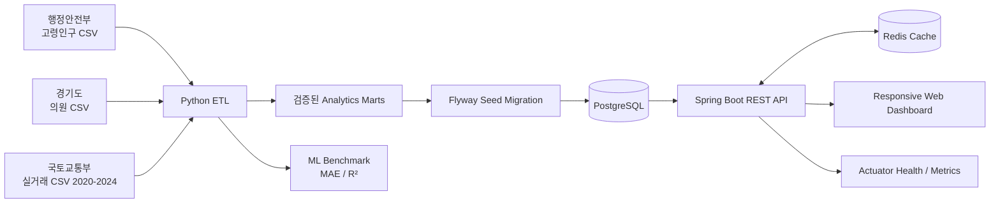

# Architecture

## Boundary decisions

- The two source analyses remain separate bounded contexts. Gyeonggi health supply and Seoul
  housing prices have different populations and geography, so a single “livability score” would
  imply a relationship the data cannot support.
- Python owns ingestion, cleaning, feature engineering, scoring and model evaluation.
- Java owns validated query APIs, caching, persistence and the browser-facing application.
- Generated CSV marts and a Flyway migration form a reviewable data contract between the layers.
- Local profile uses H2 and the Docker profile uses PostgreSQL + Redis. This keeps onboarding fast
  while exercising production-oriented infrastructure.

## Reliability and security choices

- No API credentials are committed. Historical notebook keys and machine-specific paths were removed.
- Dependency versions are constrained, raw-to-mart transformations are deterministic, and CI checks
  that generated artifacts do not drift.
- API list limits are validated, entities are not exposed directly, database schema is validated at
  startup, and the container runs as a non-root user.
- Redis entries expire after 10 minutes. Actuator exposes only health, info and metrics endpoints.

